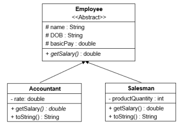

# Requirement:
Based on the class diagram specified by UML (in the picture), implement the program in the Java programming language:

- For class Abstract **Employee** implement parameterized constructor and non-parameterized constructor. For class **Accountant** and **Salesman**, implement 3 constructors: parameterized constructor, non-parameterized constructor, and copy constructor.
- Method **getSalary()** returns the salary of the object corresponding to each class:
    + 𝑆𝐴𝑐𝑐𝑜𝑢𝑛𝑡𝑎𝑛𝑡 = rate ∗ basicPay + basicPay
    + 𝑆𝑆𝑎𝑙𝑒𝑠𝑚𝑎𝑛 = 𝑝𝑟𝑜𝑑𝑢𝑐𝑡𝑄𝑢𝑎𝑛𝑡𝑖𝑡𝑦 ∗ 0.05 + basicPay
- Method **toString()** returns a string containing the attributes’ value of an object. For example, for class **Accountant**, the **toString()** method returns a string containing the name, DOB, basicPay and rate.
