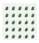
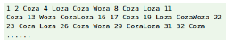
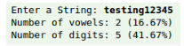
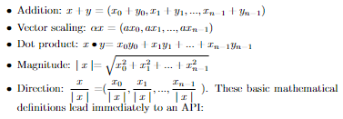

# Exercises:
## Exercise 1: 
Write a program called SquareBoard that displays the following n×n pattern using two nested for-loops. For example, let n = 5.

## Exercise 2: 
Write a program called CozaLozaWoza which prints the numbers
lowerbound to upperbound, 11 numbers per line. The program shall
print ”Coza” in place of the numbers which are multiples of 3, ”Loza” for
multiples of 5, ”Woza” for multiples of 7, ”CozaLoza” for multiples of 3
and 5, print the number if it is not divisible by 3, 5 and 7, print a newline
if number is divisible by 11. The output shall look like:

## Exercise 3: 
Write a program that argument is a file name and prints the
number of characters, words, and lines in that file. Use FileAnalyzer
function as your main function and complete FileCounter function in your
solution.

## Exercise 4: 
Write a program called CheckVowelsDigits, which prompts the
user for a String, counts the number of vowels (a, e, i, o, u, A, E, I, O,
U) and digits (0-9) contained in the string, and prints the counts and the
percentages (with 2 decimal digits). For example:

*Hints:*
- You could use lower() to convert the input string to lowercase reduce
the number of cases.
- To check if a char c is a digit, you can use build in boolean function isdigit(c)

## Exercise 5:
Write a program called PhoneKeyPad. On your phone keypad,
the alphabets are mapped to digits as follows: ABC(2), DEF(3), GHI(4),
JKL(5), MNO(6), PQRS(7), TUV(8), WXYZ(9). Write a program called
PhoneKeyPad, which prompts user for a String (case insensitive), and
converts to a sequence of keypad digits. Use a nested-if (or switch-case)
in this exercise.
*Hints:*
- You could use function to convert the input string to lowercase reduce
the number of cases.
- In nested-if, you can handle multiple cases

## Exercise 6: 
Let A, B, C. Write a program called SetOperations to find:
- MAKE SET (X1, v): add v into X1 set.
- UNION(X1, X2): The union of two sets X1 ∩X2
- INTERSECTION(X1, X2): The intersection of two sets X1 ∪X2
- DISJOINT(X1, X2): The disjoint of two sets X1 \X2
- SYMMETRIC DIFFERENCE(X1, X2): The symmetric difference of two sets X1,X2

X1 and X2 are the arguments of function, respectively. For example, Let
A = {a, b, e, f, h, i}, B = {a, c, e, g} and C = {d, g, i}. 
Print the results of operations below:
- A ∩B
- A ∩B ∩C
- A ∪B
- A ∪B ∪C
- A \B
- SYMMETRIC DIFFERENCE(A, B)

## Exercise 7: 
You will implement some operations in file from object serializa-
tion of the Card3 (in a .py source file) class.
- Write a program named CardWriter that creates a Card3 instance
and serializes it’s value into a file named card.out. Here is an example
of what CardWriter might display: Card to write is: Ace of Spades
- Write a program named CardReader that reads the Card3 object
from card. out and write its value to another file. For example: Card
read is: Ace of Spades

## Exercise 8: 
A spatial vector is an abstract entity that has a magnitude and
a direction. A sequence of n real numbers suffices to specify a vector in
n-dimensional space. We use a italic letter like x to denote the vector.
The basic operations on vectors are to add two vectors, multiply a vector
by a scalar, compute the dot product of two vectors, and to compute the
magnitude and direction, as follows:

Implement a API with these basic operations on vectors. Student must
write and read vectors object from file.
- Write a main function to produce these operations below:
    - Write a method to read two vectors from input1.vec for x and
input2.vec for y
    - Write a method to write a vector to file and then write all results
of these operations below to file output.vec:
        - x + y
        - 10x
        - |x |
        - x •y
        - |x −y 