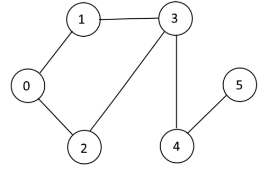

# Exercises:
Given the following graph

# Exercise 1:
Write a Python3 program to color graphs.
# Exercise 2: 
Write the result of running the program for the graph in picture above in the comment section of this lesson in google classroom.