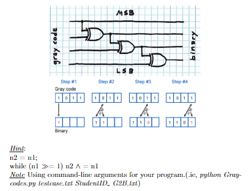

# Exercises:

## Exercise 1:
Write a function MixedRadix to implement Mixed radix generation (M) algorithm and output to file.
Note Using command-line arguments for your program.(.ie, python MixedRadix.py testcase.txt StudentID M.txt)

## Exercise 2: 
Write display method in Graycodes.py show a positive integer
number to binary represenation.
Note Using command-line arguments for your program.(.ie, python Gray-
codes.py testcase.txt StudentID D.txt)

## Exercise 3: 
Write GrayCodeGen1 and GrayCodeGen2 method which implement Gray codes generation (G) algorithm and output to file
- The input for the method above is a positive number and the output
is 000, 001, 011, 010, 110, 111, 101, 100.
- The input for the method above is a string character instead of a
positive number as the below method. or example, input is abc and
the output is all subsets: {}, {c}, {bc}, {b}, {ab}, {abc}, {ac}, {a}
Note Using command-line arguments for your program.(.ie, python Graycodes.py testcase.txt StudentID G.txt)

## Exercise 4: 
Write BinarytoGraycodes method in Graycodes.py to convert
a binary sequence to gray codes:

## Exercise 5: 
Write GraycodestoBinary method in class Graycodes.java to convert gray codes to binary sequence.
