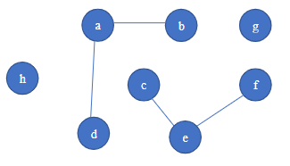

# Exercises:
Given the following undirected graph:

## Exercise 1: 
Write a program use Depth First Search algorithm to find the connected components of the undirected graph. 

## Exercise 2: 
Write a program use Breath First Search algorithm to find the connected components of the undirected graph.