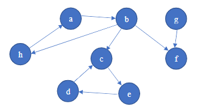

# Exercises:

Given the following directed graph:

## Exercise 1: 
Write a program implementing Kosaraju’s algorithm to find the strongly connected components of the above directed graph.

## Exercise 2: 
Write the result of running the program in the comment section of this lesson in google classroom.