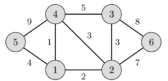

# Exercises:
Given the following undirected weighted connected graph.

## Exercise 1: 
Write a program to find MST using Kruskal’s algorithm for the above undirected weighted connected graph. 
## Exercise 2:
Write the result of running the program in the comment section of this lesson in google classroom. 