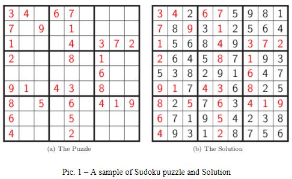
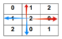
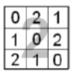
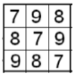
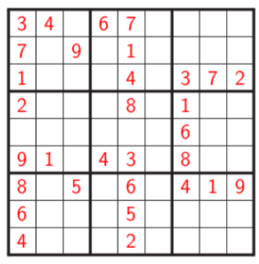

# Requirements:

## 1 Objective  
In this Assignment you have to build Sudoku puzzles using permutation and output them to file. 

## 2 Sudoku problem 
### 2.1 Definitions 
The puzzle consists of a 9×9 grid in which some of the entries of the grid have a number from 1 to 9. A traditional Sudoku puzzle 9 cells divided into 3×3 subsections called blocks. A Sudoku solution must satisfy the rules of Sudoku following: 
- Numbers in rows are not repeated 
- Numbers in columns are not repeated 
- Numbers in 3 × 3 blocks are not repeated 
- Order of the numbers when filling is not important 

### 2.2 Build Sudoku puzzle 
We start with a valid solution and generate a puzzle by picking some holes. 
#### 2.2.1 Latin Squares for Solution Generation 
To quickly and effectively generate a solution, we use the 12 unique 3×3 Latin Squares.  
Select nine 3×3 Latin Squares, with replacement. 
Place each of these squares into one of the blocks in a blank grid. In this step, you must guaratee that do not any duplicated number on row and column matrix as figure below.

Select another 3 × 3 Latin Square and match each cell with the corresponding block in the Sudoku grid. The same as the previous step, you must guaratee that do not any duplicated block in all blocks except outside block as Fig (a).  
Each cell now has a pair of numbers. Treat these pairs as base 3 numbers, and convert to base 10, adding 1 (Fig (b)). For example, with the block following:

You will obtain the first row as below:  
- 2×3+0+1=7 
- 2×3+2+1=9 
- 2×3+1+1=8 

the second row: 
- 2×3+1+1=8 
- 2×3+0+1=7
- 2×3+2+1=9 

and the third row: 
- 2×3+2+1=9 
- 2×3+1+1=8 
- 2×3+0+1=7 

Finally, you will have the result as following:

Each cell now has the numbers 1-9. However blocks contain duplicates. So that you will swap the 2nd & 4th rows, 3rd & 7th rows, and 6th & 8th rows preserving the row and column properties, and adding the desired property for blocks. Finally, we will obtain a valid solution as Fig (c).

#### 2.2.2 Digging hole 
After generating solution for Sudoku puzzle, you will dig some holes randomly to make Sudoku puzzle. For example, you will obtain Sudoku puzzle as following with the number of holes is 50.

## 3 Assignment Requirements 
Use programming language Python3 (the pure version without using any external packages like numpy,  pandas,  pytorch,...)  to  write  your  program.  Your  program  is  named  as assignment_mssv.py, where mssv is replaced by your student ID and all characters are lowercased. 

Your program is command-line based.

Users will give the number of holes as the first argument. The number of holes is multiple of 9 (for instance, 9, 18, 27, 36, 45, 54). The holes are equally distributed to all cells (for example, if the number of holes is 18, then each cell has 2 holes). Users will give the name of the output puzzle 
as the second argument. 

Your program will output to file a puzzle containing holes. In the output file 0 represents holes You have to import package random (built-in package in Python3) and apply seed function writing these commands in the beginning of your program.

`import random`  
`random.seed(m)`

where m is replaced by your student ID taking only digits (For example, student with ID 517H0050 will use m = 5170050)

An example of running your program:  
`$python3 assignment_mssv.py 9 output.txt`

The content of output.txt file is as follows: 

3, 1, 2, 4, 0, 6, 9, 7, 8    
6, 0, 5, 8, 7, 9, 1, 2, 0    
9, 7, 8, 1, 2, 3, 6, 4, 5    
0, 3, 1, 5, 6, 4, 7, 8, 9    
4, 5, 6, 0, 8, 7, 2, 0, 1    
7, 8, 9, 2, 3, 1, 5, 6, 4    
1, 2, 3, 6, 4, 0, 0, 9, 7    
5, 6, 4, 7, 9, 8, 3, 1, 2    
8, 0, 7, 3, 1, 2, 4, 5, 6   
