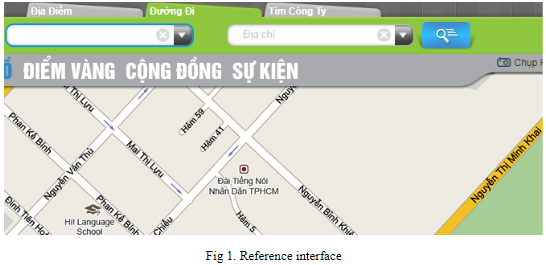
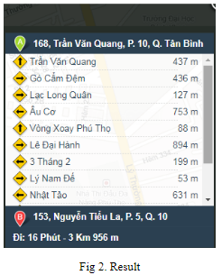
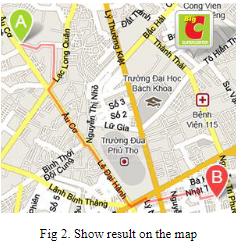

# Requirements:
Using Java language to write a GUI application that allows users to find the minimum path from a location to another.

## 1 Data  
Student searches from the Internet a map of a district in Ho Chi Minh City. In this map, select some locations (100 ≤ V ≤ 1000) and streets (500 ≤ E ≤ 10000) to make a graph data. Locations are vertices, and the streets are edges. The (relative) length of each street is the corresponding edge’s weight. The map data is stored in a text file, using one of the graph data structures.

## 2 Interface  
You may see http://www.diadiem.com/ for a reference. (Fig. 1)

The map of the selected district should be shown in this interface. 
The selected locations and streets should be highlighted in this interface. 
User can scroll (up/down, left/right), zoom (in/out) the map.  

## 3 Find the shortest path  
Allow users to input the source and destination locations from the map or combo box. 
If the inputs are incorrect, suggest the correct ones. 
Find and show the shortest path from the source to the destination. (as in Fig. 2).

Show the minimum path on the map. (as in Fig. 3)

## 4 Document 
Student needs to write an essay document to present his/her idea of implementation. The outline should be: 
1. Introduction 
2. Data 
3. Interface 
4. Find the shortest path 
5. Running results 
6. Discussions (if any)
7. References 
8. Self-evaluation. 

You need to screen-capture your running results and include them in this document. (Part 5)