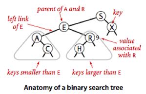
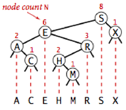
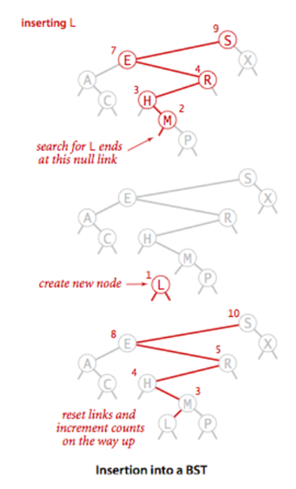
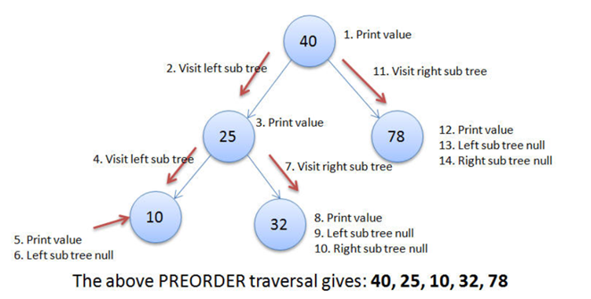
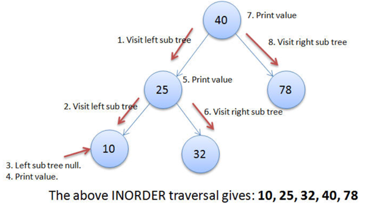
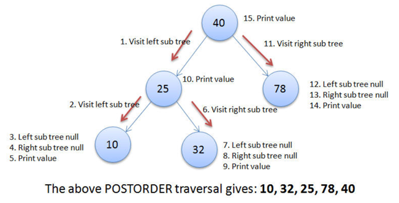
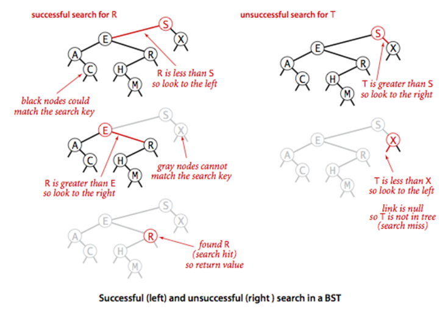
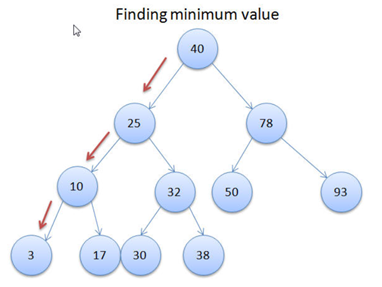
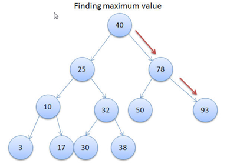

# Binary Search Tree
Binary Search Tree is a node-based binary tree data structure which has the following properties:
* The left subtree of a node contains only nodes with keys lesser than the node’s key.
* The right subtree of a node contains only nodes with keys greater than the node’s key.
* The left and right subtree each must also be a binary search tree.

## Tree Node
Create a class Node to define a BST node. Each node has a key, a left child, a right child and a size number (number of nodes in the tree).  

## Insertion
The insertion of a new node into a given BST must guarantee the properties of BST (see part 1). The new node is inserted in a leaf node so that the given tree's structure is not change to much. The insertion function, therefore, is similar to search function.

## Traversal
Once the BST has been created, its elements can be retrieved in-order by recursively traversing the left subtree of the root node, accessing the node itself, then recursively traversing the right subtree of the node, continuing this pattern with each node in the tree as it's recursively accessed. As with all binary trees, one may conduct a pre-order traversal or a post-order traversal, but neither are likely to be useful for binary search trees. An in-order traversal of a binary search tree will always result in a sorted list of node items (numbers, strings or other comparable items).

## Searching
To search a given key in Binary Search Tree, we first compare it with root, if the key is present at root, we return root. If key is greater than root’s key, we recur for right subtree of root node. Otherwise we recur for left subtree.

## Min, max value
Because of the BST’s properties, the minimum key is in the left most node of the tree and the maximum value is in the right most node of the tree. Therefore, to find the min/max value of a BST, you need to fin the left/right most node of the tree using recursion.

# Exercises
## Exercise 1
Write your createTree function that take a seri of integers as input (separate by a space character). Create a BST with some given keys.
## Exercise 2
Write a function to print on the screen all the keys of a BST in ascending order.
## Exercise 3
Write your contains function with a key input. This function return True if that key is in the tree. Otherwise, it return False.
## Exercise 4
Write sum(Node x) function that return sum of all keys from a given node (i.e. this node and its children).
## Exercise 5
Write sum() function that return sum of all keys in the BST.
