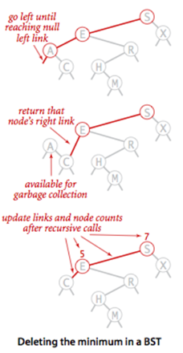

# Binary Search Tree (cont.)
## Delete the minimum node 
To delete the minimum node in a BST, we go left until reaching null left link. The node with null left link is the minimum node. We direct the link from its parent to its right child (if any). Detail steps are shown in the following figure.

2	Delete a node in a BST
1) Node to be deleted is leaf: Simply remove from the tree. 

2) Node to be deleted has only one child: Copy the child to the node and delete the child.

3) Node to be deleted has two children: Find inorder successor of the node. Copy contents of the inorder successor to the node and delete the inorder successor. Note that inorder predecessor can also be used.

The important thing to note is, inorder successor is needed only when right child is not empty. In this particular case, inorder successor can be obtained by finding the minimum value in right child of the node.

# Exercises
## Exercise 1:
Write your deleteMax function to delete the maximum node in a BST.
## Exercise 2:
Write your delete1 function to delete a node in a BST using the the maximum node of its left branch.