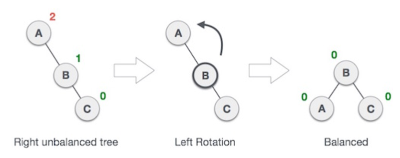
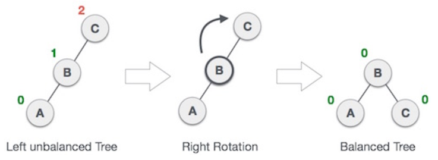
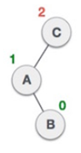
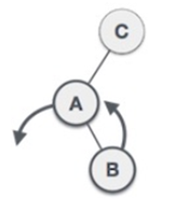
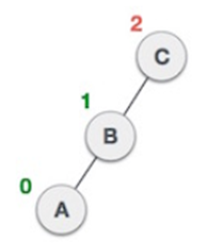
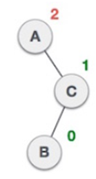
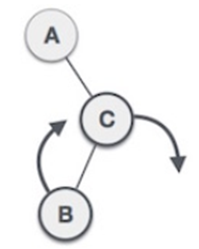
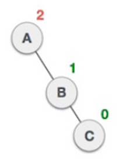
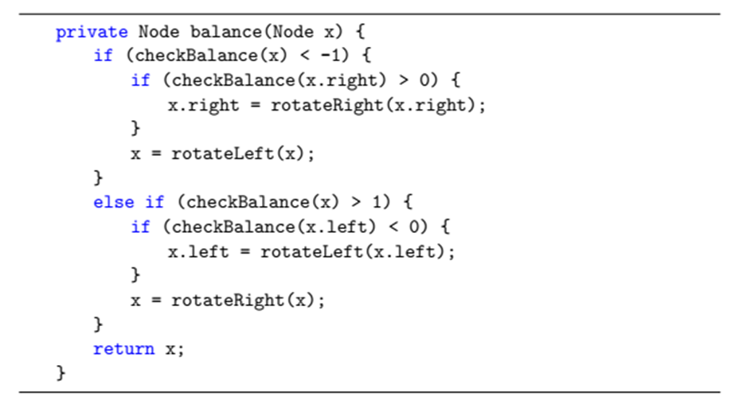

# AVL tree
An AVL tree (named after inventors Adelson-Velsky and Landis) is a self-balancing binary search tree. In an AVL tree, the heights of the two child subtrees of any node differ by at most one; if at any time they differ by more than one, rebalancing is done to restore this property. Lookup, insertion, and deletion all take O(log n) time in both the average and worst cases, where n is the number of nodes in the tree prior to the operation. Insertions and deletions may require the tree to be rebalanced by one or more tree rotations.

## Check balance
The balance factor of a AVL tree is defined to be the height difference.

## Left rotation
When a new node is inserted into a AVL tree and make it a right-right-unbalance-tree. The tree can be re-balanced using left rotation as following:

## Right rotation
When a new node is inserted into a AVL tree and make it a left-left-unbalance-tree. The tree can be re-balanced using right rotation as following:

## Left-right rotation
When a new node is inserted into a AVL tree and make it a left-right-unbalance-tree. The tree can be re-balanced using left-right rotation as following:  

Then, the process of balancing for left-left unbalance case can be used.

## Right-left rotation
When a new node is inserted into a AVL tree and make it a right-left-unbalance-tree. The tree can be re-balanced using right-left rotation as following:

Then, the process of balancing for right-right unbalance case can be used.

## Balance

# Exercise
Write a AVL tree class with insert operation.