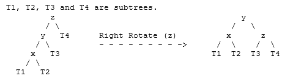
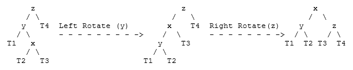
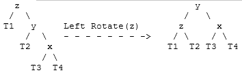
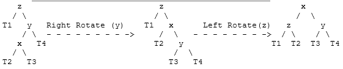

# AVL tree (cont.)
## Deletion in an AVL tree
Let w be the node to be deleted
1) Perform standard BST delete for w.
2) Starting from w, travel up and find the first unbalanced node. Let z be the first unbalanced node, y be the larger height child of z, and x be the larger height child of y. 
3) Re-balance the tree by performing appropriate rotations on the subtree rooted with z. There can be 4 possible cases that needs to be handled as x, y and z can be arranged in 4 ways. Following are the possible 4 arrangements:

    **a. y is left child of z and x is left child of y (Left Left Case)**
      
    **b. y is left child of z and x is right child of y (Left Right Case)**
      
    **c. y is right child of z and x is right child of y (Right Right Case)**
      
    **d. y is right child of z and x is left child of y (Right Left Case)**
    

## Insertion vs Deletion
Like insertion, there are 4 cases for rebalancing the tree. However, unlike insertion, fixing the node z won’t fix the complete AVL tree. After fixing z, we may have to fix ancestors of z as well. 

That is, in deletion, after we perform a rotation at z, we may have to perform a rotation at ancestors of z. Thus, we must continue to trace the path until we reach the root.

The main difference compared to Insert(v) in AVL tree is that we may trigger one of the four possible rebalancing cases several times, but not more than h = O(log N) times.

# Exercise
Modify your AVL tree class with delete operation.

