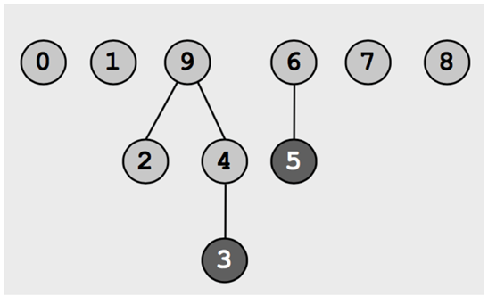
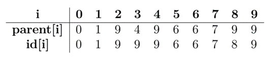
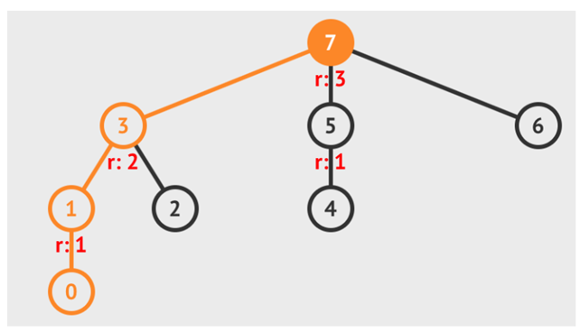
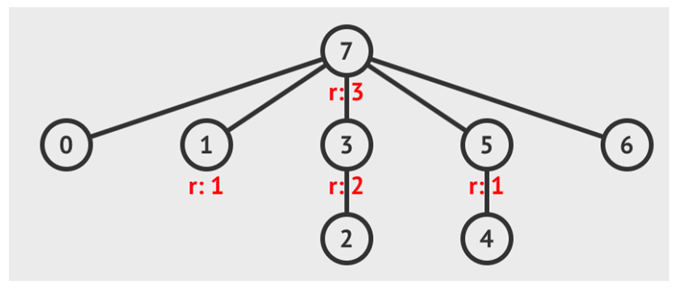
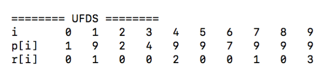

# Union‐Find Disjoint Sets (UFDS)

## Definition
The Union-Find Disjoint Sets (UFDS) data structure is used to model a collection of disjoint sets, which is able to efficiently (i.e. in nearly constant time) determine which set an item belongs to, test if two items belong to the same set, and union two disjoint sets into one when needed.

## Operations
Given a set X = {1, 2, …, n} with n elements. 
We need to implement operations that maintain subsets X1, X2, …, Xk of X such that X_i ∩ X_j = ∅; 1 ≤ j < j ≤ k.

* makeSet(n): Create a set with n elements.
* findSet(x): Return id (representative item) of the set that cointain x.
* unionSet(x,y): Replace 2 set A and B (x∈A,y∈B,A∩B=∅ ) with the new set A∪B.

## Present Disjoint Sets with tree structure
Each set is presented into a tree. Each tree have a representative item (root or id). Each node stores the information of its parent node.
Rank of an item is used to optimize the union operation of 2 sets. It is used to determine which item will be root after the union operation.   
	1. A new created node have rank 0.  
	2. If x is not root node, its rank is lesser than its parent’s.  
	3. Rank of x is changed only when x is the root. If a node is no longer the root, its rank will be never changed.  
	4. When x’s parent is changed, the new parent will have a greater rank (compared with the old parent’s).  
	5. The are at most n/2^r  node with rank ≥ r.

## makeSet
makeSet take a integer n as the input and return a set with n different elements.

## findSet
This operation is used to find the representative item (root or id) of a set. We follow the parent relationships until come to a node with no parent (or it is its parent).  

**Compressing the path** is a technique to improve search time on the tree structure. After each findSet operation, we update the parent of each node on the path from x to root node. The new parents are the root. 

## unionSet
This operation is used to union 2 tree (or set) into a new tree (set). The root of the lower rank tree will become the new root.

# Exercises
## Exercise 1:
Write a print function to output on the screen a UFDS with the following format.
  
The elements of the set are listed in the first line. The second line is for their parents. The third line is for their ranks.

## Exercise 2:
Write isSameSet function to test whether 2 elements are in the same set.
## Exercise 3:
Write countSet function to count how many UFDSs.
## Exercise 4:
Rewrite your class using array only, not using Vector.
## Exercise 5:
Rewrite the functions of questions 1, 2, 3 for UFDS_Array in question 4.