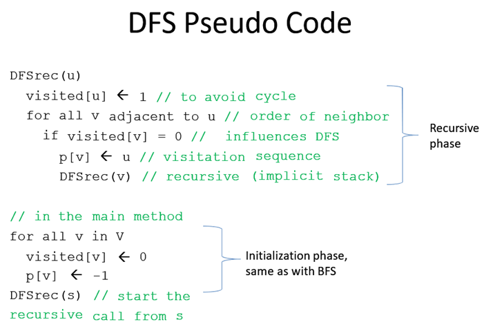
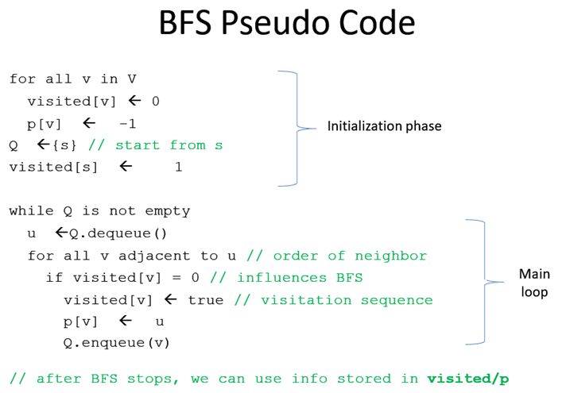

# Depth-First Search (DFS)
Input parameter: The source vertex s.  
Complexity: O(V+E).  
DFS starts from a distinguished source vertex s and uses recursion (an implicit stack) to order the visitation sequence as deep as possible before backtracking.  
If DFS is at a vertex u and it has **X** neighbors, it will pick the first neighbor **V1** (usually the vertex with the lowest vertex number), recursively explore all reachable vertices from vertex **V1**, and eventually backtrack to vertex **u**. DFS will then do the same for the other neighbors until it finishes exploring the last neighbor VX and its reachable vertices.  
If the graph is **cyclic**, the previous 'try-all' strategy may lead DFS to run in cycle.  
So the basic form of DFS uses an array **status[u]** of size V vertices to decide between binary conditions: Whether vertex **u** has been visited or unvisited. Only if vertex u is still unvisited, then DFS can visit vertex **u**.  
When DFS runs out of option, it **backtrack** to previous vertex (**p[u]**) as the recursion unwinds.  
DFS uses another array p**p[u]** of size **V** vertices to remember the **parent/predecessor/previous** of each vertex **u** along the DFS traversal path.  
The predecessor of the source vertex, i.e. **p[s]** is set to **-1** to say that the source vertex has no predecessor (as the lowest vertex number is vertex 0).  
The sequence of vertices from a vertex u that is reachable from the source vertex s back to s forms the **DFS spanning tree**. We color these **tree edges** with red color.

# Breadth-First Search (BFS)
Input parameter: The source vertex s.  
Complexity: O(V+E).  
Both DFS and BFS have their own strengths and weaknesses. It is important to learn both and apply the correct graph traversal algorithm for the correct situation.  
BFS is very similar with DFS that have been discussed earlier, but with some differences.  
BFS starts from a source vertex s but it uses a queue to order the visitation sequence as breadth as possible before going deeper.
BFS also uses a Boolean array of size **V** vertices to distinguish between two states: visited and unvisited vertices (we will not use BFS to detect back edge(s) as with DFS).  
In this visualization, we also show that starting from the same source vertex s in an **unweighted graph**, BFS spanning tree of the graph equals to its SSSP spanning tree.  

# Exercises
Read a graph given by adjacency matrix from a text file.
## Exercise 1:
Write your DFS function for the given graph from a input starting vertex s. Print your traversal result on the screen.
## Exercise 2:
Write your BFS function for the given graph from a input starting vertex s. Print your traversal result on the screen.
## Exercise 3:
Write your IsReachable function to test whether vertex v is reachable from vertex u, where u and v is input.

