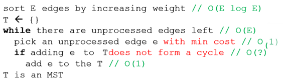
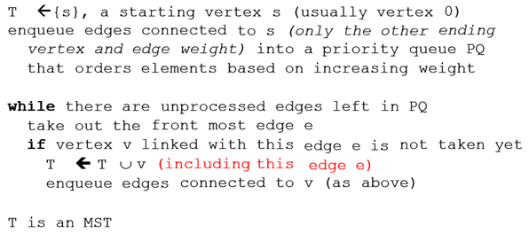

# Minimum Spanning Tree (MST)
A Spanning Tree (ST) of a connected undirected weighted graph G is a subgraph of G that is a tree and connects (spans) all vertices of G. A graph G can have multiple STs, each with different total weight (the sum of edge weights in the ST).  
A Min(imum) Spanning Tree (MST) of G is an ST of G that has the smallest total weight among the various STs.  
The MST problem is a standard graph (and also optimization) problem defined as follows: Given a connected undirected weighted graph G = (V, E), select a subset of edges of G such that the graph is still connected but with minimum total weight. The output is either the actual MST of G (there can be several possible MSTs of G) or usually just the minimum total weight itself (unique).

# Kruskal's algorithm
An O(E log V) greedy MST algorithm that grows a forest of minimum spanning trees and eventually combine them into one MST.
Kruskal's requires a good sorting algorithm to sort edges of the input graph by increasing weight and another data structure called Union-Find Disjoint Sets (UFDS) to help in checking/preventing cycle.  
Kruskal's algorithm first sort the set of edges E in non-decreasing weight (there can be edges with the same weight), and if ties, by increasing smaller vertex number of the edge, and if still ties, by increasing larger vertex number of the edge.  
Discussion: Is this the only possible sort criteria?  
Then, Kruskal's algorithm will perform a loop through these sorted edges (that already have non-decreasing weight property) and greedily taking the next edge e if it does not create any cycle w.r.t edges that have been taken earlier.  
   

**To sort the edges:**
* We use *EdgeList* to store graph information
* Then use “any” sorting algorithm that we have seen before

**To test for cycles:**
* We use *Union‐Find Disjoint Sets*

# Prim's algorithm (Jarnik-Prim's algorithm)
Another O(E log V) greedy MST algorithm that grows a Minimum Spanning Tree from a starting source vertex until it spans the entire graph.  
Prim's requires a Priority Queue data structure (usually implemented using Binary Heap) to dynamically order the currently considered edges based on increasing weight, an Adjacency List data structure for fast neighbor enumeration of a vertex, and a Boolean array to help in checking cycle.  
Prim's algorithm starts from a designated source vertex s and enqueues all edges incident to s into a Priority Queue (PQ) according to increasing weight, and if ties, by increasing vertex number (of the neighboring vertex number). Then it will repeatedly do the following greedy steps: If the vertex v of the front-most edge pair information e: (w, v) in the PQ has not been visited, it means that we can greedily extends the tree T to include vertex v and enqueue edges connected to v into the PQ, otherwise we discard edge e.  

 
You just need to use two known Data Structures  to be able to implement Prim’s algorithm:
1.	A priority queue (we can use Java PriorityQueue), and
2.	A Boolean array (to decide if a vertex has been taken or not)

# Exercises
Read a graph given by adjacency matrix from a text file.
## Exercise 1:
Write your Kruskal function for the given graph. Print your MST result on the screen.
## Exercise 2:
Write your Prim function for the given graph from a input starting vertex s. Print your MST result on the screen.
