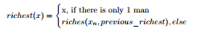
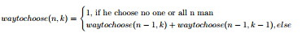
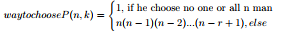
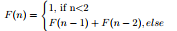

# Exercises:
In a certain kingdom, there is a king name Shahryar, who, was a very generous and wise. But, one day, Shahryar found out that his wife was unfaithful to him.
Blinded by wrath, he order his wife execution. Furthermore, he decided that, everyday, he will marry a new wife then behead them in the next day to make sure that he can’t never be cheated on again. After killed 1001 women, it was Scheherazade turn to marry the king. Unlike other women, before going to bed, Scheherazade start telling the king many tales. She always make sure that her tales are not ended by the morning of next day and the king have to keep her alive to hear the rest of her tale.
1. That night, Scheherazade told the story of Alibaba. The story about how Alibaba infiltrate the lair of 40 thieves with a magic password: "Open Sesame"and stole their treasures. The boss of thieves then tell one of them to trace his footstep to a town. Mark the door that Alibaba’s foot steps lead to and will get the whole gang to raid his house. However, by the time they come to Alibaba’s town, all doors have the same special marks on them. The boss of thieves angrily kill his subordinate thinking the guy betrayed him. Their treasures still being looted by Alibaba whenever they go out. This time, the boss send 2 thieves to Alibaba’s foot step. A similar result happen to the 2 subordinates. He keep increase the number of his thieves until not enought of them left and finally got caught by the authorities. Knowing that the number of thieves is 40. The number of thieves sent on day n is calculated by:
    * *thieves(day x)= x + sum from day 1 to day x-1*

Implement on python a function in a recursive way to calculate the number of thieves sent on day x then calculate how many days until he can’t send anymore thieves to Alibaba’s foot step.

2. Another night, Scheherazade is telling the story of Aladdin, who is famous for stealing money from the richest man in the town everyday. To know who is the new richest man, Aladdin compare his money to the previous richest man then proceed break in his house for the loot. The way Aladdin calculate is describe as follow:

Write a python function richest(X) in a recursive way, given that the men are compared by the number of their gold coins which are integers.

3. One of the most popular story within 1001 night is the story of Sinbad, a tale of the seaman Sinbad and his crews. When he is recruiting crew, there are many who want to follow him since he is a son of a very wealthy merchant. However, he want to choose a number of k crew so that he can test their combination in around 1000 way. Knowing that, there is n=50 people who want to follow him, the way to test their combination is:

Help Sinbad find the k that give the number of ways to choose as close to 1000 as possible.

4. However, his father tell him that his way of choosing won’t work on a ship since he need people on specific position such as cook or fighter,... instead of risking his crew with only cleaners or boat rowers. This time, he agree to increase his test permutation to 10000 way. Knowing that, there is n=50 people who still want to follow him, the way to test their permutation is:   

5. According to the story, Scheherazade was telling tales for 1001 nights.
After which, she tell Shahryar to execute her but please stop his killing routine. The king, who has been listening to Scheherazade stories about trusting, heroism, and forgiving for 1001 nights, smile and tell her that he has been in love with her for a very long time and did not plan for her execution even if she can’t tell him any tale. Assume that Scheherazade has a total of 1 character on her first story, 2 characters on her 2nd story, 4 characters on her 3rd story, 8 characters on her 4th story ... and she told 547 stories in 1001 night. Write a recursive function to calculate how many characters has appeared in Scheherazade’s stories.

6. Leonardo Fibonacci is a very famous mathematician who popularized the
use of Arabic number and number 0 in Roman empire. In fact, a very
famous sequence was named after him. The Fibonacci sequence, which
can be described in a recursive way:

Write a recursive function to return the nth number of Fibonacci sequence.

7. In 1883, a French mathematician invented a puzzle, in which, there are n disks from a pillar (A) with uneven sizes and the larger disks always under the smaller disks. The puzzle want to move all the disk from pillar (A) to pillar (C) with a medium pillar (B) as a mean to transfer since only 1 disk can be moved at a time and the larger disks have to be under the smaller disks. Legend said that, In a monastery on a certain mountain in Hanoi, There are 3 pillars and 64 disks. Everyday, a monk will move 1 disk from 1 pillar to another with the same rule described above and when all the disks move to the last is when the world end. Assume the monk use the optimal way, 264 − 1 day will be needed to complete the puzzle which mean we still have a very long time. The optimal way to solve the Lucas’s puzzle or Tower of Hanoi is described as follow:
    * (a) If h > 1, then first use this procedure to move the h - 1 smaller disks from peg A to peg B.
    * (b) Now the largest disk, i.e. disk h can be moved from peg A to peg C.
    * (c) If h > 1, then again use this procedure to move the h - 1 smaller disks from peg B to peg C.

Write a recursive Python function towerOfHanoi(A,B,C) in which,
describe the process of moving all the number from list A=[[’A’],[1,2,3,4,5,...,n]] to list C=[[’C’],[]] via list B[[’B’],[]]
